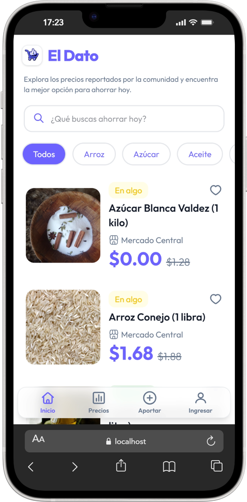
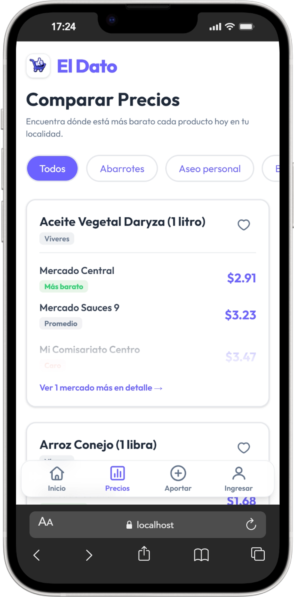
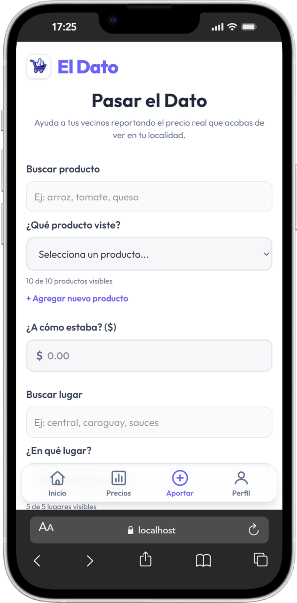
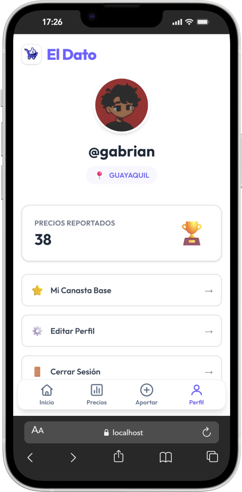
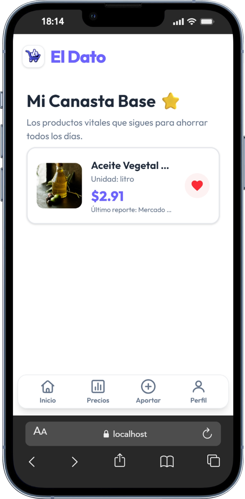

# 📍 El Dato - ¡Pilas con el ahorro!

> **El Dato** es una red comunitaria para reportar, comparar y validar precios reales de mercados locales por localidad.

Proyecto desarrollado para la **Hackatón CubePath 2026**.

---

## 🚀 Demo

- Demo en CubePath: https://vps23813.cubepath.net/
- Video demo (GIF): [docs/gifs/demo.gif](docs/gifs/demo.gif)

## 📸 Capturas / GIF

| Home | Comparar | Reportar |
| --- | --- | --- |
|  |  |  |

| Perfil | Canasta |
| --- | --- |
|  |  |

### 🎬 Demo GIF


## 🧐 ¿Qué es El Dato?

En tiempos de economía variable, comparar precios reales hace diferencia. El Dato permite a la comunidad:

- Consultar precios reportados por otros usuarios.
- Comparar mercados por producto.
- Reportar nuevos precios desde su localidad.
- Votar la confiabilidad de los reportes.
- Guardar productos clave en su canasta base.

Actualmente, el proyecto trabaja con localidades como **Guayaquil, Quito y Cuenca** (arquitectura extensible a más ciudades).

## ✨ Funcionalidades principales

- Inicio con reportes recientes y búsqueda/filtro por categoría.
- Comparador de precios por producto con favoritos.
- Reporte de precios con autocompletado de producto y lugar.
- Creación de nuevo producto/lugar desde el formulario.
- Subida de imagen optimizada para nuevos productos.
- Detalle de producto con historial de precios y votación comunitaria.
- Detalle de mercado con reportes recientes.
- Perfil de usuario con edición de datos y localidad.
- Canasta base (favoritos) con último precio reportado.
- Mis reportes con eliminación de aportes propios.

## 🛠️ Stack tecnológico

- Frontend: React 19 + Vite + Tailwind CSS 4.
- Routing: React Router.
- Backend/DB/Auth/Storage: Supabase.
- Notificaciones: Sonner.
- Infraestructura: CubePath (VPS).

## 🧱 Arquitectura resumida

- Rutas lazy-loaded con `React.lazy` + `Suspense`.
- Rutas protegidas para secciones privadas (`/report`, `/profile`, `/edit-profile`, `/my-reports`, `/favorites`).
- Paginación por backend en reportes (`offset`, `limit`, `withMeta`) e infinite scroll.
- Normalización de localidad para filtrar datos por comunidad (`gye`, `uio`, `cue`).

## 🗺️ Rutas principales

- Públicas: `/`, `/welcome`, `/prices`, `/product/:id`, `/market/:id`, `/login`, `/register`.
- Protegidas: `/report`, `/profile`, `/edit-profile`, `/my-reports`, `/favorites`.

## ⚙️ Configuración local

1. Clona el repositorio

```bash
git clone https://github.com/Gabriand/El-Dato.git
cd El-Dato
```

2. Instala dependencias

```bash
npm install
```

3. Configura variables de entorno en `.env`

```plaintext
VITE_SUPABASE_URL=tu_url
VITE_SUPABASE_PUBLISHABLE_DEFAULT_KEY=tu_key
```

4. Ejecuta en desarrollo

```bash
npm run dev
```

## ☁️ Implementación en CubePath

- Se creó un VPS en CubePath para publicar la aplicación.
- En el servidor se instaló Node.js, se clonó este repositorio y se ejecutó `npm install`.
- Se configuraron las variables de entorno de Supabase para el build de Vite.
- Se generó la versión de producción con `npm run build`.
- Se publicó la carpeta `dist/` en el servidor con Nginx y fallback SPA (`/index.html`) para React Router.

## ⚖️ Licencia

Este proyecto está bajo licencia [MIT](LICENSE).

Hecho con ❤️ en Guayaquil para la Hackatón CubePath 2026.
